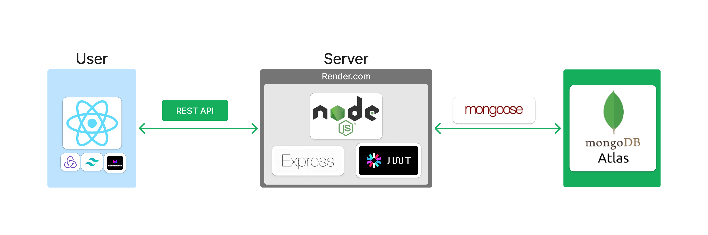

# Restaurant Web App - MVP

## Synopsis
This is the mvp (minimum valuable product) of the restaurant web app.

## Web app architechture

 

## Directories
* [Frontend](./frontend/)
* [Backend](./backend/)

## Authors
###### MVP
- Kaleb wendwessen - [Github](https://github.com/leonileo)/[Linkedin](https://linkedin.com/in/kaleb-wendwessen) 

## License
#### [MIT License](./LICENSE.txt)